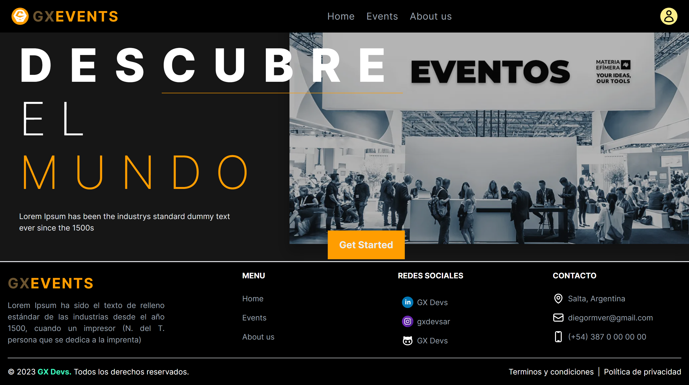
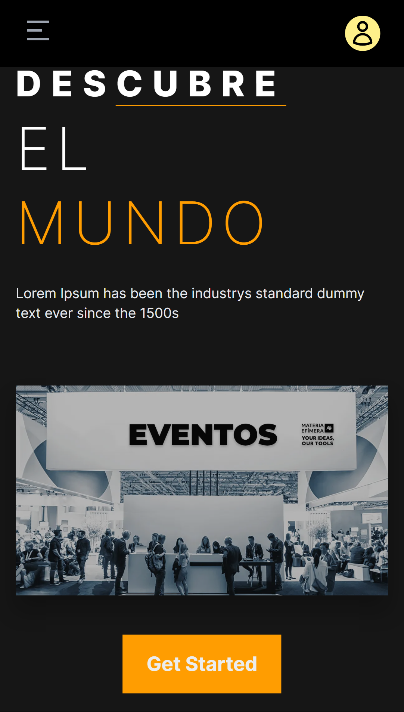
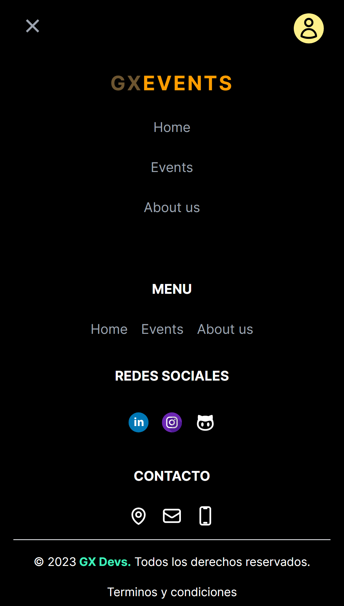

## 🚀 Como ejecutarlo en local

Necesitarás tener instalado ``` node.js ``` y tener acceso a una terminal para seguir los siguientes pasos:
>
1. Necesitamos clonar el proyecto añadiendo la siguiente linea de comando en una terminal
```
git clone https://github.com/DiegoRMV/web-games-store.git
```
>
2. Entramos a la carpeta que acabamos de clonar e instalamos las dependencias necesarias
```
npm install
#
yarn
```
>
3. Necesita configurar NEXT_PUBLIC_TICKETMASTER_API_kEY en .env.template, puede aquirir la apikey en: 

    https://developer.ticketmaster.com/products-and-docs/apis/getting-started/

    Luego cambie el nombre a .env.local.
>
4. Ejecutamos nuestro proyecto en local
```
npm run dev
#
yarn dev
```

💻 En computadora
>


📱 En móvil
>
 